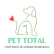

Veterinária PetTotal - README

Este documento é um guia completo para entender a estrutura, as marcações HTML, as regras de estilo CSS e o funcionamento geral do site da **Veterinária PetTotal**. Cada elemento utilizado foi escolhido para garantir semântica, acessibilidade, responsividade e manutenção facilitada.

---

## 1. Visão Geral do Projeto

O site da Veterinária PetTotal é composto por cinco páginas principais:

* **index.html**: página inicial, apresenta informações sobre os serviços e a clínica.
* **fotos.html**: galeria de imagens das instalações e do atendimento.
* **videos.html**: galeria de vídeos institucionais e depoimentos.
* **mapa.html**: exibe um mapa interativo com a localização da clínica.
* **servicos.html**: lista de serviços oferecidos, em formato de tabela.

O objetivo é fornecer uma interface clara e organizada, com **HTML semântico**, **CSS moderno** (Flexbox e media queries) e um design em **tons de verde** que reforça a identidade de saúde e bem-estar.

---

## 2. Estrutura de Arquivos

```
/                  # Raiz do projeto
│-- index.html     # Página inicial
│-- fotos.html     # Galeria de fotos
│-- videos.html    # Galeria de vídeos
│-- mapa.html      # Localização (mapa)
│-- servicos.html  # Tabela de serviços
│-- style.css      # Regras de estilo do site
│-- favicon.ico    # Ícone do site (aparece na aba)
│-- logo-pet.png   # Logotipo da clínica
│-- banner-pet.jpg # Imagem de destaque do banner
│-- pet1.jpg ...   # Imagens usadas nas seções
└-- README.md      # Este documento explicativo
```

---

## 3. Marcação HTML Detalhada

### 3.1 Declaração e Elementos Globais

```html
<!DOCTYPE html>
<html lang="pt-BR">
<head>
  <meta charset="UTF-8">
  <meta name="viewport" content="width=device-width, initial-scale=1.0">
  <title>Veterinária PetTotal</title>
  <link rel="icon" href="/favicon.ico">
  <link rel="stylesheet" href="style.css">
</head>
<body>
  ...
</body>
</html>
```

* `<!DOCTYPE html>`: define o documento como HTML5, garantindo suporte a recursos modernos.
* `<html lang="pt-BR">`: atributo `lang` melhora acessibilidade para leitores de tela e SEO, indicando o idioma principal.
* `<meta charset="UTF-8">`: define codificação Unicode, evitando problemas com caracteres acentuados.
* `<meta name="viewport" content="width=device-width, initial-scale=1.0">`: configura a viewport para dispositivos móveis, garantindo responsividade.
* `<title>`: texto exibido na aba do navegador; importante para SEO e usabilidade.
* `<link rel="icon" href="/favicon.ico">`: referência ao favicon, reforçando identidade na aba.
* `<link rel="stylesheet" href="style.css">`: importa o arquivo de estilo global.

### 3.2 Barra de Localização

```html
<div class="top-location">📍 Av. Central, 123 – Centro, Cidade Fictícia – SP</div>
```

* `<div>`: contêiner genérico.
* `class="top-location"`: identifica e aplica estilos específicos para exibir a localização sempre visível no topo.
* Emoji "📍": ícone visual rápido que reforça o significado.

### 3.3 Cabeçalho e Logo

```html
<header class="header">
  
  <h1>Veterinária PetTotal</h1>
</header>
```

* `<header>`: elemento semântico para conteúdo de introdução.
* `class="header"`: aplica estilos de cor, padding e layout.
* `` com `alt`: exibe o logotipo; `alt` descreve imagem para acessibilidade.
* `<h1>`: título principal do site, importante para SEO.

### 3.4 Navegação

```html
<nav class="nav-links">
  <a href="index.html">Início</a>
  <a href="fotos.html">Fotos</a>
  ...
</nav>
```

* `<nav>`: define bloco de links de navegação; semântico e reconhecido por leitores de tela.
* `<a>`: links para outras páginas, text-transform uppercase e `:hover` para feedback visual.

### 3.5 Banner de Destaque

```html
<section class="banner">
  
</section>
```

* `<section>`: semântico para agrupar conteúdo relacionado.
* `class="banner"`: estilos garantem imagem full-width e responsiva.
* ``: ocupa 100% da largura do viewport, criando impacto visual.

### 3.6 Seções de Conteúdo (info-block)

```html
<section class="info-block">
  <div class="photo"></div>
  <div class="text">
    <h2>Atendimento Especializado</h2>
    <p>...texto...</p>
  </div>
</section>

<section class="info-block reverse">...invertido...</section>
```

* `<section>`: separa blocos semânticos.
* `class="info-block"`: aplica `display: flex` para layout horizontal.
* `class="reverse"`: adiciona `flex-direction: row-reverse` para alternar posição de foto/texto.
* `<div class="photo">` e `<div class="text">`: contêineres para isolamento de estilos.
* `<h2>`: título secundário, hierarquia abaixo de `<h1>`.
* `<p>`: parágrafos de descrição.

### 3.7 Galeria de Fotos (photo-gallery)

```html
<section class="photo-gallery">
  <div class="photo-item">
    
    <p>Descrição</p>
  </div>
  ...
</section>
```

* `class="photo-gallery"`: `display: flex; flex-wrap: wrap` para grid fluido.
* `class="photo-item"`: define largura, margem e alinhamento de cada item.
* `<p>`: legenda da imagem.

### 3.8 Galeria de Vídeos (video-gallery)

```html
<section class="video-gallery">
  <div class="video-item">
    <iframe src="..." allowfullscreen></iframe>
    <p>Legenda</p>
  </div>
  ...
</section>
```

* `iframe`: incorpora player externo (YouTube).
* `allowfullscreen`: permite tela cheia.
* `class="video-gallery"`: layout similar à galeria de fotos.

### 3.9 Inclusão de Mapa

```html
<section class="map">
  <h2>Nosso Endereço</h2>
  <iframe src="https://www.google.com/maps/embed?..." allowfullscreen></iframe>
</section>
```

* `iframe`: embed do Google Maps.
* `<h2>`: título da seção.
* `class="map"`: padding e estilo específico.

### 3.10 Tabela de Serviços

```html
<section class="service-table">
  <h2>Serviços</h2>
  <table>
    <tr><th>Serviço</th><th>Descrição</th><th>Preço</th></tr>
    <tr><td>Consulta</td><td>...</td><td>R$</td></tr>
    ...
  </table>
</section>
```

* `<table>`: semântico para dados tabulares.
* `<th>`: cabeçalho de coluna.
* `<td>`: célula de dados.
* `class="service-table"`: estilo de margem e largura.

### 3.11 Rodapé

```html
<footer class="footer">
  <p>&copy; 2025 Veterinária PetTotal</p>
  <div class="socials">
    <a href="#">Facebook</a> | ...
  </div>
</footer>
```

* `<footer>`: semântico para conteúdo final.
* `<p>`: copyright.
* `<a>`: links de redes sociais com espaçamento.

---

## 4. CSS - Explicação de Cada Seção

### 4.1 Reset de Estilos

```css
* {
  margin: 0;
  padding: 0;
  box-sizing: border-box;
}
```

* Remove espaçamentos padrões e define `box-sizing: border-box` para cálculo de largura incluir bordas.

### 4.2 Corpo da Página

```css
body {
  font-family: Arial, sans-serif;
  background-color: #f0fff4;
  color: #1b5e20;
}
```

* Define fonte legível e paleta de fundo clara com contraste no texto.

### 4.3 Barra de Localização

```css
.top-location {
  background-color: #388e3c;
  color: white;
  text-align: center;
  padding: 8px;
  font-size: 0.9rem;
}
```

* Cor verde escura de destaque, centralização de texto e padding para conforto visual.

### 4.4 Cabeçalho e Navegação

```css
.header { display: flex; align-items: center; background-color: #2e7d32; padding: 15px 20px; gap: 15px; }
.logo { width: 60px; height: 60px; }
.header h1 { color: white; font-size: 1.8rem; }
.nav-links { display: flex; justify-content: center; background-color: #1b5e20; }
.nav-links a { color: #c8e6c9; padding: 12px 18px; font-weight: bold; text-transform: uppercase; }
.nav-links a:hover { background-color: #2e7d32; color: white; }
```

* Flexbox para alinhar logo e título.
* Estados `hover` nos links para feedback.

### 4.5 Banner

```css
.banner img { width: 100%; height: auto; display: block; }
```

* Garante imagem responsiva e sem espaçamento extra.

### 4.6 Info-Block

```css
.info-block { display: flex; align-items: center; gap: 20px; padding: 30px 10%; }
.info-block.reverse { flex-direction: row-reverse; }
.photo img { width: 400px; max-width: 100%; border-radius: 6px; }
.text { flex: 1; }
```

* Layout lado a lado com espaçamento.
* Responsive por `max-width`.
* Borda levemente arredondada.

### 4.7 Galerias

```css
.photo-gallery, .video-gallery { display: flex; flex-wrap: wrap; gap: 20px; padding: 30px 10%; }
.photo-item, .video-item { width: calc(50% - 20px); }
iframe, img { border-radius: 6px; }
```

* Grid fluido com wrap e gap.
* Itens ajustam-se a metade da largura menos gap.

### 4.8 Mapa e Tabela

```css
.map iframe { width: 100%; height: 400px; border: 0; border-radius: 6px; }
.service-table table { width: 100%; border-collapse: collapse; }
.service-table th, td { border: 1px solid #a5d6a7; padding: 12px; text-align: center; }
.service-table th { background-color: #66bb6a; color: white; }
```

* Tabela legível, cores que combinam com paleta verde.

### 4.9 Rodapé

```css
.footer { background-color: #2e7d32; color: white; text-align: center; padding: 20px 0; }
.footer a { color: #c8e6c9; text-decoration: none; }
.footer a:hover { text-decoration: underline; }
```

* Contraste e legibilidade, links com indicação de hover.

### 4.10 Responsividade

```css
@media (max-width: 768px) {
  .info-block, .info-block.reverse { flex-direction: column; text-align: center; }
  .photo-gallery .photo-item, .video-gallery .video-item { width: 100%; }
  .nav-links { flex-wrap: wrap; }
}
```

* Torna layout vertical em telas pequenas para melhor leitura e navegação.

---

## 5. Funcionamento Geral

1. **Carregamento**: O navegador carrega `index.html`, lê o `head` e aplica o CSS de `style.css`.
2. **Renderização**: Elementos HTML são renderizados semântica e estilisticamente.
3. **Interação**: Links de navegação trocam páginas, que utilizam a mesma estrutura.
4. **Responsividade**: Media queries ajustam o layout em diferentes tamanhos de tela.
5. **Favicon**: Navegador busca `/favicon.ico` e exibe o ícone na aba.

---

## 6. Personalização

* Alterar imagens: substitua arquivos em `src` pelos novos nomes.
* Ajustar textos: edite conteúdos de `<h2>`, `<p>` e `<table>`.
* Mudar cores: modifique valores em `style.css` para a nova paleta.
* Adicionar páginas: duplique `index.html`, atualize nav-links e conteúdo.

Este guia explica detalhadamente cada parte do site e a razão por trás das escolhas, permitindo que qualquer desenvolvedor entenda e evolua o projeto.
